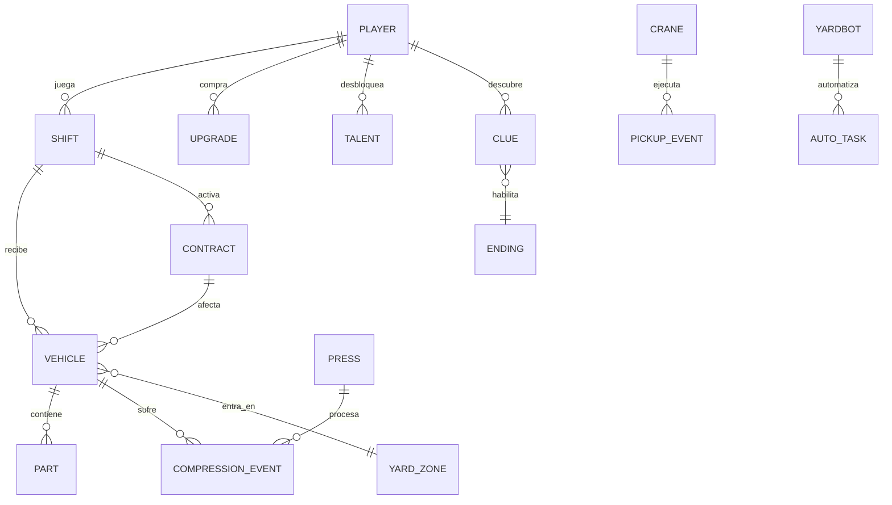

# Ideación profunda de juegos minimalistas en primera persona y diseño de un patio de chatarra magnético

## Resumen ejecutivo

Los referentes más útiles para pensar “otro **Berry Bury Berry**” no son sólo incrementales clásicos, sino juegos que convierten un **verbo simple** en una rutina física y sensorial: *Berry Bury Berry* gira alrededor de cultivar y arrojar bayas a un hoyo ominoso; *A Game About Digging A Hole* reduce todo a cavar, vender, mejorar y descubrir un secreto; *Donut County* hace crecer un agujero a medida que “devora” objetos; *Viscera Cleanup Detail* transforma la limpieza posterior al horror en comedia macabra; *Hardspace: Shipbreaker* vuelve el salvataje una danza de corte, clasificación y deuda; *PowerWash Simulator* construye un negocio entero encima de la satisfacción de limpiar; y *(the) Gnorp Apologue* demuestra que los números “suban visualmente” también puede ser espectáculo. En conjunto, muestran un patrón consistente: verbo claro, feedback físico, mejora visible, economía legible y una capa de misterio o rareza que sostiene la curiosidad. citeturn7view7turn7view8turn7view6turn7view5turn7view4turn15view0turn7view9

La investigación académica reciente sobre idle/incremental refuerza ese patrón. Hwang y Melcer encontraron que, en sus estudios, los idle games resultaron tan engaging como juegos casuales y aislaron cinco rasgos especialmente valiosos: progreso mientras el jugador está ausente, crecimiento exponencial, desbloqueos nuevos y **visiblemente aplicados**, estética/feedback atractivos y progreso continuo. Cutting, Gundry y Cairns propusieron además que el engagement en este tipo de juegos puede entenderse como un **hábito** sostenido por frecuencia de chequeo y sociabilidad dentro y fuera del juego. citeturn3view1turn6view0turn6view2turn6view3turn6view4turn6view5turn3view2

De las diez ideas propuestas abajo, la más fuerte para desarrollo real es el **patio de chatarra con grúa imantada y prensa**, porque concentra todo lo que el subgénero necesita en una sola fantasía de poder: una máquina central muy legible, interacción física rica pero de baja complejidad, una progresión natural hacia automatización/idle, y un contraste tonal poderoso entre satisfacción industrial y una narrativa escondida sobre el origen de ciertos autos. La propuesta completa que sigue asume PC, sin motor específico, y recomienda un proyecto premium compacto con campaña corta rejugable y modo infinito. Esa recomendación calza mejor con cómo se distribuyen en Steam la mayoría de los referentes directos del nicho físico-relajante/extraño, en lugar de forzar monetización agresiva o live-ops. citeturn7view7turn7view8turn7view6turn7view4turn15view0turn14view0turn7view0

## Patrones del subgénero y criterios de ideación

La oportunidad de diseño no está en copiar la superficie de *Berry Bury Berry* sino en reproducir su **estructura de deseo**. Los referentes citados convierten una tarea mundana o absurda en una actividad que el jugador quiere repetir: cavar, lavar, limpiar, cortar, clasificar, devorar o arrojar. En todos los casos hay una acción principal muy fácil de leer, un resultado físico inmediato y una promesa de “la próxima mejora” o “el próximo secreto”. Eso baja la barrera de entrada y hace que el juego se entienda en segundos, pero permita escalar durante horas. citeturn7view7turn7view8turn7view6turn7view5turn7view4turn15view0

La literatura sobre idle/incremental aporta criterios concretos para convertir esa intuición en diseño. Los cinco elementos señalados por Hwang —jugar “mientras estás fuera”, crecimiento exponencial, desbloqueos visibles, estética atractiva y progreso continuo— son especialmente útiles para un juego minimalista en primera persona porque evitan que el loop se sienta plano o “de checklist”. También encajan con la advertencia de Pedro Furtado en su postmortem: en incrementales, gran parte de la diversión surge del **descubrimiento**, y el balance y la facilidad para crear contenido importan muchísimo; además, la temática funciona mejor cuando está integrada a la acción principal del jugador, no sólo pegada como historia lateral. citeturn6view0turn6view2turn6view3turn6view4turn6view5turn12view0

Para primera persona, el “game feel” no puede dejarse al final. El trabajo de Lin y colegas sobre *impact feel* encontró que la coherencia sonora y el control de cámara influyen fuertemente en la sensación de impacto, y trabajos recientes sobre game feel emocional defienden que ese diseño momento-a-momento puede modular emociones más allá de la simple satisfacción. En paralelo, GDC subraya que la primera persona funciona mejor cuando el avatar se siente como algo más que “una cámara con piernas”, sin sacrificar respuesta ni generar mareo. En un proyecto como el del patio de chatarra, esto se traduce en una fantasía táctil muy concreta: balanceo controlable, peso perceptible, golpes de metal, vibración visual moderada y cámaras auxiliares legibles. citeturn3view3turn13search3turn11view0

De aquí salen seis criterios de ideación que conviene respetar en los diez conceptos y en el concepto desarrollado:

- **Un verbo dominante** que se entienda al instante.
- **Una entidad central** visual y sistémica —pozo, prensa, silo, caldera, clasificador— alrededor de la cual gire todo.
- **Física legible antes que simulación extrema**, para que el juego “se sienta” caro sin ser caro de producir.
- **Progresión visible cada pocos minutos**, con mejoras que cambien el espacio, el ritmo o la máquina, no sólo un número.
- **Contraste tonal** entre lo cozy/ridículo y lo inquietante, como en el jardín maldito de *Berry Bury Berry* o la limpieza “morbidly hilarious” de *Viscera Cleanup Detail*. citeturn7view7turn7view5
- **Narrativa escondida optativa**, suficiente para alimentar curiosidad sin romper el loop principal. citeturn7view7turn7view8turn7view4

## Diez conceptos de juego propuestos

Los diez conceptos siguientes son **propuestas originales** diseñadas con esos criterios. Todos apuntan a: minimalismo sistémico, primera persona, interacción fisicalizada, progresión incremental, contraste tonal y una narrativa escondida. La tabla compara lo esencial; la primera fila es el concepto que desarrollo en profundidad después.

| Concepto | Pitch breve | Verbo núcleo | Entidad central | Tipo de progresión | Emoción dominante |
|---|---|---|---|---|---|
| **Patio Imán** | Operas una grúa electromagnética en un patio de chatarra para mover, apilar y compactar autos; poco a poco descubres que varios VIN no deberían existir. | Arrastrar y compactar | Grúa imantada + prensa | Throughput → automatización → meta por expedientes | Poder industrial y culpa |
| **Silo de Semillas** | Aspiras semillas y frutos mutados de un invernadero y los viertes en un silo “vivo” que exige nuevas mezclas. | Aspirar y verter | Silo biológico | Tier de cultivos → bioreacción → crecimiento ausente | Calma agrícola y rareza orgánica |
| **Archivo de Ceniza** | Clasificas expedientes y objetos de oficina para alimentarlos en una caldera ministerial; los sellos desbloquean nuevas alas del edificio. | Sellar e incinerar | Caldera burocrática | Permisos → cintas → autoarchivo | Orden y paranoia |
| **Lavado de Santos** | Limpias estatuas, vitrales y altares con herramientas de restauración; bajo la mugre aparecen nombres borrados y rostros cambiados. | Lavar y revelar | Altar/taller de restauración | Herramientas → zonas sagradas → reconstrucción visual | Serenidad y revelación |
| **Catacumba de Cables** | Desenredas cables viejos, los trituras, refundes cobre y vuelves a energizar túneles clausurados. | Tirar y triturar | Trituradora-subestación | Voltaje → nodos → auto-ruteo | Tensión táctil y amenaza |
| **Invernadero de Moho** | Rocías esporas, cosechas hongos y alimentas un biorreactor; cada cepa altera el espacio y las voces del greenhouse. | Rociar y cosechar | Biorreactor | Cepas → bandejas → clonación automática | Asco tierno y curiosidad |
| **Centro de Paquetería Fantasma** | Tomas paquetes de una cinta y los envías por compuertas codificadas; algunas direcciones son imposibles y regresan “corregidas”. | Agarrar y clasificar | Clasificador postal | Nuevas líneas → lectores → desvío automático | Orden y ansiedad |
| **Faro de Polvo** | Aspiras óxido, arena y residuos marinos para pulir la lente de un faro-máquina que empieza a emitir señales extrañas. | Aspirar y pulir | Lente-faro | Filtros → potencia → fases nocturnas | Soledad y trascendencia |
| **Cámara de Hielo** | Derrites bloques y extraes relicarios para una prensa criogénica; cada hallazgo altera la temperatura del complejo. | Fundir y extraer | Fundidor criogénico | Calor → aislamiento → catálogo de reliquias | Descubrimiento y claustrofobia |
| **Molino de Escayola** | Rompes moldes de yeso para rescatar objetos internos y luego reciclas el polvo en nuevas piezas vendibles. | Quebrar y moler | Tambor de molienda | Patrones → moldes → línea semiautomática | Tactilidad y inquietud arqueológica |

Visto como portafolio de producción, **Patio Imán**, **Archivo de Ceniza** y **Catacumba de Cables** son los tres conceptos con mejor relación entre claridad del loop, potencial de física y capacidad de sostener una narrativa escondida con poco contenido authored. El primero gana porque usa una **máquina protagonista** muy fuerte y comprensible incluso en un GIF de 5 segundos, algo que ya funcionó para juegos de loop simple como *Berry Bury Berry*, *A Game About Digging A Hole* y *PowerWash Simulator*. citeturn7view7turn7view8turn15view0

## Concepto desarrollado: Patio Imán

### Premisa y fantasía central

**Patio Imán** es un juego en primera persona para PC donde el jugador trabaja turnos en un patio de chatarra operando una **grúa electromagnética gigante** y una **prensa compactadora**. El placer base es tomar un auto destrozado, levantarlo con dificultad, corregir el balanceo, acomodarlo en la tolva o la prensa, escuchar cómo el metal cede y cobrar. La rareza aparece cuando empiezan a entrar unidades duplicadas, placas adulteradas y expedientes de decomiso que no coinciden con la flota civil de la ciudad. La fantasía mezcla el salvataje físico de *Hardspace: Shipbreaker*, la satisfacción rutinaria de *PowerWash Simulator*, la tonalidad laboral extraña de *Viscera Cleanup Detail* y la economía simple-secreta de *Berry Bury Berry*. citeturn7view4turn15view0turn7view5turn7view7turn14view0

**Supuestos de propuesta:** single-player, mouse+teclado y control, motor no especificado, campaña de **4–6 horas** en primera vuelta más **modo infinito** de contratos. La primera hora debe entregar una mejora significativa cada **3–5 minutos**, porque la investigación del género muestra que los desbloqueos visibles y el crecimiento perceptible sostienen la retención. citeturn6view3turn6view4turn6view5

### Bucle central, acciones del jugador y economía

El loop base debe ser corto, táctil y escalable:

| Paso | Acción del jugador | Duración objetivo | Recompensa principal | Riesgo/error |
|---|---|---:|---|---|
| Recepción | Escanear el auto entrante | 5–8 s | Información: peso, pureza, piezas valiosas, anomalías | Ignorar riesgo EV/combustible |
| Reubicación | Levantarlo con la grúa y llevarlo a la zona correcta | 10–25 s | Combo de manejo y bonus de precisión | Balanceo, golpe, caída mala |
| Despiece opcional | Retirar 1–3 piezas valiosas | 10–20 s | Cash extra por batería, catalizador, ECU, cobre | Tiempo perdido si se hace mal |
| Compactación | Alinear y comprimir | 12–18 s | Pago base + bono por densidad/perfect drop | Menor valor si entra torcido |
| Venta/mejora | Cobrar y comprar upgrades | 5–15 s | Más throughput, nuevas áreas, automatización | Mala inversión |
| Investigación | Leer expediente, hallar cache, abrir lote clausurado | Variable | Claves narrativas, meta, finales | Distracción del flujo óptimo |

**Modelo económico propuesto.** El cálculo tiene que ser visible y comprensible:

```text
Ingreso por auto = valor de chatarra + valor de piezas + bono de maniobra + bono de contrato - penalizaciones
```

```text
valor de chatarra = toneladas ferrosas × 110 × pureza × multiplicador de prensa
```

Valores de referencia para balance inicial:

| Clase de auto | Masa ferrosa media | Pago base compactado | Piezas comunes extraíbles | Valor común total |
|---|---:|---:|---|---:|
| Hatchback | 0.8 t | $95 | batería, ECU | $18–$40 |
| Sedán | 1.1 t | $130 | batería, catalizador, cobre | $45–$90 |
| SUV/van | 1.6 t | $185 | batería, catalizador, rines, cobre | $60–$120 |
| Pickup | 1.9 t | $225 | batería, catalizador, motor liviano | $70–$135 |
| EV/híbrido | 1.7 t | $210 | pack, controladora, cobre fino | $90–$180 |

Objetivo de ritmo económico propuesto:

- **Inicio:** 5–6 autos por turno corto, **$700–$1,000** por turno.
- **Mitad:** 7–9 autos, **$2,000–$3,200** por turno.
- **Final:** 10–12 autos, **$6,000+** por turno con automatización parcial.

Esta curva responde a dos necesidades del género: crecimiento exponencial durante juego activo y progreso que siga siendo perceptible al volver a entrar. citeturn6view2turn6view3turn6view5turn3view2

### Controles, física y sensación

La interacción debería dividirse en dos modos.

**Modo a pie**
- WASD: movimiento.
- Mouse: cámara.
- `E`: interactuar/usar consola.
- `F`: escáner rápido.
- `Tab`: tablet de patio, contratos y mejoras.
- `R`: reacomodo manual de pieza pequeña.
- `C`: agacharse.
- `Shift`: trote corto.

**Modo grúa**
- WASD o stick izquierdo: mover el carro del pórtico en X/Y.
- `Q/E` o gatillos: bajar/subir imán.
- Mouse/stick derecho: cámara libre.
- `LMB`: energizar imán.
- `RMB`: modo precisión.
- `Space`: pulso de liberación o sacudida.
- Rueda: zoom.
- `1/2/3`: cámaras auxiliares.
- `F`: ping de escáner sobre el vehículo tomado.

La clave no es la simulación total, sino una **física híbrida**. Propongo autos como rigidbodies con:
- puntos ferrosos de anclaje,
- suspensión simplificada,
- piezas desprendibles seleccionadas,
- y **4 estados de deformación** procedimental al compactarse, en vez de soft-body completo.

Eso permite vender peso, inercia y deformación sin heredar el costo técnico de una destrucción total tipo *Teardown*. Como inferencia de producción, para un juego minimalista conviene priorizar una sensación convincente de masa y colisión antes que una simulación plenamente destructible de cada panel. citeturn8search1turn8search10turn14view0

Para que la grúa “se sienta bien”, el feedback debería seguir tres reglas:

1. **Sway legible:** el auto se balancea, pero el jugador siempre puede corregirlo.
2. **Impacto compacto:** al golpear suelo/prensa hay audio metálico coherente, vibración visual breve y cámara amortiguada, nunca caos permanente.
3. **Precisión recompensada:** si el auto entra alineado y a baja velocidad, se activa “drop perfecto” con bono de compactación.

Eso está alineado con la evidencia de que sonido y cámara pesan mucho en el impacto percibido, y con las recomendaciones de GDC para que la primera persona no se sienta como una cámara flotante ni maree. citeturn3view3turn11view0turn7view3

Parámetros de feel propuestos:
- Damping de balanceo base: **0.72**
- Desvío lateral máximo cómodo: **18°**
- Ventana de “drop perfecto”: centro dentro de **0.6 m**, velocidad vertical menor a **1.4 m/s**, desviación angular menor a **7°**
- Sacudida visual por impacto: **0.08–0.18 s**
- “Precision mode”: velocidad de grúa **-60%**, damping **+50%**, costo de tiempo compensado con bonus

### Progresión, automatización y meta-progresión

La progresión se sostiene en cuatro capas:

**Capa de herramientas.** Mejoras duras y visibles de la grúa, la prensa y el patio. Cada compra debe cambiar algo perceptible: más fuerza, más cobertura, más velocidad, menor penalización, más valor o nuevas clases de autos.

**Capa de habilidad.** Tres árboles de talento:
- **Operador:** control fino, balanceo, drops perfectos.
- **Capataz:** contratos, colas, combos, progreso en ausencia.
- **Investigador:** escáner, rarezas, pistas narrativas.

**Capa idle/automatización.** A mitad del juego aparecen helpers muy concretos:
- yardbot recolector,
- autocargador de prensa,
- desmontaje automático de piezas comunes,
- despacho en ausencia por ventana limitada.

Esto conecta con lo que la literatura identifica como una de las claves del género: progreso mientras el jugador no está mirando, pero sin convertir el juego en una planilla completamente pasiva. citeturn6view0turn6view2turn6view5turn7view0

**Capa meta.** Cada ruta final o auditoría completada otorga **Insignias de Operador**. Esas insignias no mejoran números “sin sentido”, sino que abren nuevas corridas con cambios concretos: comenzar con un contrato especial, desbloquear autos fuera de catálogo, habilitar el lote membrana, ampliar la investigación de VIN o empezar con una estación ya instalada. La meta-progresión debe sentirse como **nueva lectura del patio**, no sólo como multiplicador abstracto.

## Sistema detallado de mejoras, árboles y diagramas

### Flujo de progresión temprana a tardía

```mermaid
flowchart LR
    A[Inicio\n5-6 autos por turno\nEscáner manual + prensa básica] --> B[Compras tempranas\nBobina I\nRieles I\nCabrestante I]
    B --> C[Lectura del valor\nEscáner VIN\nBanco de despiece\nJaula de baterías]
    C --> D[Mitad del juego\nDrops perfectos\nMesa de clasificación\nPrensa II]
    D --> E[Expansión del patio\nExtensión de pórtico\nCabezal dual]
    E --> F[Automatización\nYardbot junior\nAutocargador]
    F --> G[Escala industrial\nFundición nocturna\nDespacho autónomo]
    G --> H[Investigación avanzada\nRadar del lote 17\nContrato de flotilla]
    H --> I[Finales\nObediencia\nAuditoría\nRescate]
```



### Modelo de entidades



### Tabla de 30 mejoras y talentos

**Moneda de upgrades:** dinero del turno.  
**Moneda de talentos:** puntos de operador.  
**Notas:** todos los números son **propuesta de diseño**, no datos de un juego existente.

| ID | Nodo | Tipo | Costo | Requisito | Efecto cuantificado |
|---|---|---|---:|---|---|
| U01 | Bobina reforzada I | Upgrade | $150 | — | **+25%** fuerza magnética |
| U02 | Rieles engrasados I | Upgrade | $180 | — | **+15%** velocidad de carro |
| U03 | Cabrestante rápido I | Upgrade | $220 | — | **+20%** velocidad vertical |
| U04 | Escáner VIN | Upgrade | $300 | — | Muestra masa, pureza y riesgo; detecta piezas raras en **12 m** |
| U05 | Guías de prensa I | Upgrade | $450 | — | **-12%** tiempo de compactación |
| U06 | Banco de despiece | Upgrade | $650 | — | **-20%** tiempo de extraer piezas manuales |
| U07 | Jaula de baterías | Upgrade | $800 | U04 | Desbloquea EV/híbridos; **+25%** valor de baterías/packs |
| U08 | Bobina reforzada II | Upgrade | $1,050 | U01 | **+25%** fuerza magnética adicional |
| U09 | Rieles engrasados II | Upgrade | $1,250 | U02 | **+15%** velocidad de carro adicional |
| U10 | Cabrestante rápido II | Upgrade | $1,450 | U03 | **+20%** velocidad vertical adicional |
| U11 | Cámaras de alineación | Upgrade | $1,900 | U04 | **-50%** penalidad por mala caída; zona de “drop perfecto” **+0.25 m** |
| U12 | Mesa de clasificación | Upgrade | $2,400 | U06 | **-50%** penalización por contaminación/mezcla |
| U13 | Guías de prensa II | Upgrade | $3,100 | U05 | **-15%** tiempo de compactación adicional |
| U14 | Extensión de pórtico | Upgrade | $4,200 | U09 | **+35%** cobertura útil del patio |
| U15 | Cabezal dual imán/cadena | Upgrade | $6,300 | U08, U10 | **-20%** balanceo; habilita arrastre de carrocerías con poco metal |
| U16 | Yardbot junior | Upgrade | $9,500 | U12 | Recolecta chatarra suelta hasta **$140/min** |
| U17 | Autocargador de prensa | Upgrade | $14,500 | U13, U15 | Carga **1 auto/26 s** desde cola de **3** |
| U18 | Fundición nocturna | Upgrade | $21,000 | U16 | Convierte fardos en lingotes al cerrar turno; **+15%** valor de venta |
| U19 | Despacho autónomo | Upgrade | $29,000 | U16, U17 | Progreso en ausencia por **20 min** al **35%** del throughput activo |
| U20 | Contratos de flotilla | Upgrade | $55,000 | U12 | **+2** autos por turno; **+12%** valor medio de lote |
| T01 | Manos firmes | Talento Operador | 1 pt | — | **+10%** amortiguación del balanceo |
| T02 | Caída suave | Talento Operador | 1 pt | T01 | Umbral de velocidad segura **+20%** |
| T03 | Tirón lateral | Talento Operador | 2 pt | T01 | **+15%** fuerza lateral; **-30%** atascos por ángulo |
| T04 | Ritmo de compactación | Talento Operador | 2 pt | T02 | “Drop perfecto” da **+8%** payout |
| T05 | Línea caliente | Talento Capataz | 1 pt | — | Primeros **3** autos del turno valen **+10%** |
| T06 | Cadena de montaje | Talento Capataz | 2 pt | T05 | Ventana de combo **+3 s**; cap de combo **+10%** |
| T07 | Horas muertas | Talento Capataz | 3 pt | T06 | Eficiencia del progreso en ausencia **+10 pp** |
| T08 | Responsable de turno | Talento Capataz | 3 pt | T06 | **+1** slot de contrato y **1 reroll** por turno |
| T09 | Ojo de chatarrero | Talento Investigador | 1 pt | — | **+6%** probabilidad de pieza rara |
| T10 | Lectura forense | Talento Investigador | 2 pt | T09 | Escáner revela anomalías ocultas; **+12%** aparición de pistas |
| T11 | Archivo rojo | Talento Investigador | 3 pt | T10 | **+1** pista garantizada en autos anómalos; habilita ruta de Auditoría |
| T12 | Perito fantasma | Talento Investigador | 4 pt | T11 | Autos anómalos pagan **+20%** y habilitan final de Rescate |

### Mockups de UI y UX

La UI tiene que ser funcional y mínima, con texto claro y alto contraste, porque el jugador alterna entre mirar masa física en 3D y leer datos de contratos. Las guías de accesibilidad recomiendan contraste alto, tipografía legible, progreso del texto al ritmo del jugador y evitar texto en movimiento sobre fondos activos; además, en primera persona conviene dejar FOV configurable. citeturn7view1turn7view3

**HUD a pie**

```text
┌ Shift 04 ──────────────── Contrato: Sedanes decomisados 3/8 ───────────────┐
│ Caja: $2,480      XP: 640/1000      Combo x2 (09s)      Pista: 1 nueva    │
├──────────────────────────────────────────────────────────────────────────────┤
│ [F] Escanear      [E] Interactuar      [Tab] Tablet      [C] Agacharse     │
│                                                                              │
│                 Auto: Sedán B / 1.12 t / Pureza 0.84 / Riesgo: Combustible  │
│                 Pieza visible: Catalizador ($45)                             │
│                                                                              │
│                              ⊙ retícula simple                               │
└──────────────────────────────────────────────────────────────────────────────┘
```

**HUD de grúa**

```text
┌ Patio Imán ─ Grúa Norte ─ Cámara 2 ─ Precisión ON ──────────────────────────┐
│ Caja $3,120      Drop perfecto +8%      Cola prensa: 2/3      Imán 78%      │
├──────────────────────────────────────────────────────────────────────────────┤
│ Carro X: 62%   Carro Y: 41%   Altura: 5.3 m   Balanceo: 7°   Carga: 1.18 t  │
│                                                                              │
│                        [▣ zona ideal de compactación ▣]                      │
│                                                                              │
│ [LMB] Imantar   [Space] Soltar/Pulso   [1/2/3] Cámaras   [F] Ping escáner   │
└──────────────────────────────────────────────────────────────────────────────┘
```

**Tablet de patio**

```text
┌──────────────────── TABLET ─ PATIO IMÁN ────────────────────┐
│ LOTES  |  UPGRADES  |  TALENTOS  |  EXPEDIENTES  |  AJUSTES │
├──────────────────────────────────────────────────────────────┤
│ Upgrades disponibles                                          │
│  - U16 Yardbot junior ........... $9,500   [Comprar]         │
│  - U17 Autocargador de prensa .... $14,500  [Bloqueado]      │
│  - U18 Fundición nocturna ........ $21,000  [Bloqueado]      │
│                                                              │
│ Expediente raro                                              │
│  “Sedán gris VIN duplicado / Lote 17 / traslado nocturno”   │
│  [Leer] [Marcar] [Seguir pista]                              │
└──────────────────────────────────────────────────────────────┘
```

## Producción, estilo, secretos y cierre de diseño

### Dirección audiovisual y tono

Visualmente, la propuesta funciona mejor con **low-poly robusto o semiestilizado**, iluminaciones de atardecer industrial, siluetas grandes y pocos materiales: hierro oxidado, pintura de seguridad, concreto húmedo, lonas, etiquetas fluorescentes. No conviene ir a hiperrealismo: el valor está en la **claridad espacial** del patio y en que cada mejora cambie algo visible. La investigación de Hwang sugiere que la estética y el feedback visible son parte central del engagement en este género, no “adornos”. citeturn6view4turn6view5

En audio, el paquete mínimo debería incluir:
- hum de la bobina con pitch dinámico según carga,
- crujidos de suspensión,
- golpes de chasis contra concreto,
- compresor con tres capas de graves,
- lluvia lejana o autopista de fondo,
- radio AM del capataz con mensajes ambiguos,
- y stingers muy discretos al detectar anomalías.

Esto no sólo refuerza atmósfera: también mejora el *impact feel*, que la literatura vincula de forma importante con coherencia sonora. citeturn3view3turn13search3

### Secretos y finales posibles

El contraste tonal debería repetirse en toda la experiencia. Igual que *Berry Bury Berry* mezcla dulzura y ominosidad, o *Viscera Cleanup Detail* mezcla trabajo rutinario y aftermath horror, aquí la tensión está en que el trabajo del patio es casi meditativo… hasta que el jugador entiende qué está compactando. citeturn7view7turn7view5

**Ruta de secreto propuesta**
- Autos con VIN duplicado.
- Órdenes de trituración “sin inspección”.
- Grabaciones nocturnas del lote clausurado.
- Registros de decomisos imposibles.
- Un sedán intacto que nunca debe entrar a la prensa.

**Tres finales sugeridos**
- **Obediencia.** El jugador maximiza productividad, firma el protocolo de despacho autónomo y deja el patio funcionando solo. Final eficiente, frío y moralmente oscuro.
- **Auditoría.** Reúne suficientes pruebas, abre el lote 17 y expone la red de decomisos fraudulentos. Final “verdad”, más difícil.
- **Rescate.** Reconstruye el auto clave en lugar de compactarlo y usa la fundición nocturna para sabotear el sistema. Final más raro y emocional.

### Monetización recomendada

La monetización recomendada es **premium simple**: juego base de compra única, demo pública breve y, si hace falta, soundtrack/artbook aparte. No recomendaría pase de batalla, energía, boosters pagos ni una capa F2P artificial. La razón no es ideológica sino de ajuste producto-mercado: en PC, los referentes inmediatos del nicho —de *Berry Bury Berry* a *A Game About Digging A Hole*, *Donut County*, *Hardspace: Shipbreaker*, *PowerWash Simulator* y *Junkyard Simulator*— se presentan como productos premium de Steam, mientras que el propio GDC reconoce que el idle puede monetizarse como F2P pero desde loops y metas muy distintos. Para este proyecto, el valor diferencial está en la compacidad, la rareza y la experiencia táctil, no en una economía “service”. citeturn7view7turn7view8turn7view6turn7view4turn15view0turn14view0turn7view0

### Accesibilidad y rendimiento

En accesibilidad, el paquete mínimo debería incluir: remapeo completo de teclado y control, acciones tipo “mantener o alternar”, slider de FOV, sensibilidad horizontal/vertical separada, toggle de motion blur, intensidad de cámara/temblor, ayudas de alineación opcionales, texto escalable, alto contraste para información crítica y señales que no dependan sólo del color. Eso coincide con Game Accessibility Guidelines, Microsoft XAG y con la utilidad práctica del soporte basado en acciones de Steam Input. citeturn7view1turn7view3turn7view2

En rendimiento, el mayor riesgo técnico del concepto es la densidad de objetos físicos. *Junkyard Simulator* tuvo que dedicar varias actualizaciones a optimización, lectura/carga de objetos, física y suavidad general; además, el salto a Unreal Engine 5 se comunicó justamente en términos de tiempos de carga, física y estabilidad. Como inferencia de diseño, eso sugiere que un patio de chatarra convincente debe proteger alcance desde el día uno: deformación por estados, debris pool limitado, rigidbodies en sleep, activación por proximidad, poco conteo simultáneo de autos “activos”, y cámaras auxiliares en lugar de reflejos o destrucción total de alta frecuencia. citeturn14view1turn14view0

**Objetivos de performance propuestos**
- 60 FPS estables en GPU media actual.
- Máximo de **6** autos plenamente “awake” al mismo tiempo.
- Debris suelto reciclable en pool de **120–180** piezas.
- Dos LOD fuertes para autos a distancia.
- Compresión/resolución offline de colisiones secundarias fuera de cámara.

### Plan de prototipado y pruebas

El postmortem de Furtado es especialmente útil acá: en incrementales hay que prototipar rápido, automatizar balance temprano y asegurarse de que la temática esté metida en la acción principal. Por eso el plan recomendable no empieza con historia, sino con el verbo, el feel y la curva de mejora. citeturn12view0

| Fase | Duración estimada | Entregable | Qué se valida |
|---|---:|---|---|
| Greybox mecánico | 1 semana | Patio simple, 1 auto, 1 grúa, 1 prensa | ¿Levantar, balancear y compactar ya es divertido? |
| Feel y cámaras | 1 semana | Damping, audio, cámaras 1/2/3, precision mode | ¿Se siente pesado pero controlable? ¿Marea? |
| Economía mínima | 1 semana | 3 clases de autos, pago base, 6 upgrades tempranos | ¿Hay una compra valiosa cada 3–5 min? |
| Despiece y riesgo | 1 semana | Batería, catalizador, EV simple | ¿La decisión “compactar ya vs desmontar” tiene tensión? |
| Automatización | 1 semana | Yardbot junior + progreso en ausencia acotado | ¿Sube el engagement al volver? |
| Narrativa escondida | 1 semana | 3 pistas, 1 anomalía, 1 mini-final | ¿La rareza suma curiosidad sin romper el loop? |
| Vertical slice | 2 semanas | 20 upgrades, 2 árboles, 2 zonas | ¿Existe ya un ciclo completo temprano-medio? |
| Playtests externos | 2 semanas | 12–20 jugadores | ¿Qué mejora compra primero? ¿Dónde abandonan? |

**Métricas de prueba recomendadas**
- Tiempo al primer “momento wow” de compactación.
- Tiempo a la primera compra significativa.
- Autos procesados por minuto.
- Porcentaje de drops perfectos.
- Frecuencia de chequeo/retorno en sesiones cortas.
- Recordación de pistas narrativas.
- Preferencia por modo activo vs automatizado.

**Criterios de éxito del vertical slice**
- Al menos **70%** de testers quiere “un turno más”.
- Primera mejora relevante antes de **5 min**.
- Primer sistema de automatización antes de **40 min**.
- Comprensión espontánea del secreto central sin exposición verbal pesada.

## Fuentes clave

Las fuentes más útiles para este informe fueron páginas oficiales de Steam, documentación/charlas de desarrollo y trabajos académicos recientes sobre idle games, engagement y game feel. Las citas enlazan directamente a cada fuente.

**Fuentes primarias y oficiales de juegos**
- *Berry Bury Berry* en Steam. citeturn7view7
- *A Game About Digging A Hole* en Steam. citeturn7view8
- *Donut County* en Steam. citeturn7view6
- *Hardspace: Shipbreaker* en Steam. citeturn7view4
- *Viscera Cleanup Detail* en Steam. citeturn7view5
- *(the) Gnorp Apologue* en Steam. citeturn7view9
- *PowerWash Simulator* en Steam. citeturn15view0
- *Junkyard Simulator* en Steam y notas oficiales de actualización. citeturn14view0turn14view1

**Investigación y charlas de diseño**
- Hwang, *Player Engagement with Idle Games: A Mixed-Methods Exploration with Design Implications*. citeturn3view0turn6view0turn6view2turn6view3turn6view4turn6view5
- Hwang y Melcer, *Exploring Engagement in Idle Game Design* (IEEE CoG 2024). citeturn3view1
- Cutting, Gundry y Cairns, *Busy doing nothing? What do players do in idle games?* citeturn3view2
- Lin et al., *What Features Influence Impact Feel?* citeturn3view3
- Bhatnagar et al., *Game Feel Design for Emotionally Impactful Experiences*. citeturn13search3
- GDC Vault, *Idle Games: The Mechanics and Monetization of Self-Playing Games*. citeturn7view0
- GDC Vault, *Animation Bootcamp: Giving Purpose to First-Person Animation*. citeturn11view0
- Steamworks, documentación de Steam Input. citeturn7view2
- Game Accessibility Guidelines y Microsoft XAG 117. citeturn7view1turn7view3

**Referencia metodológica de prototipado incremental**
- Pedro Furtado, *Lessons of my first incremental game*. citeturn12view0